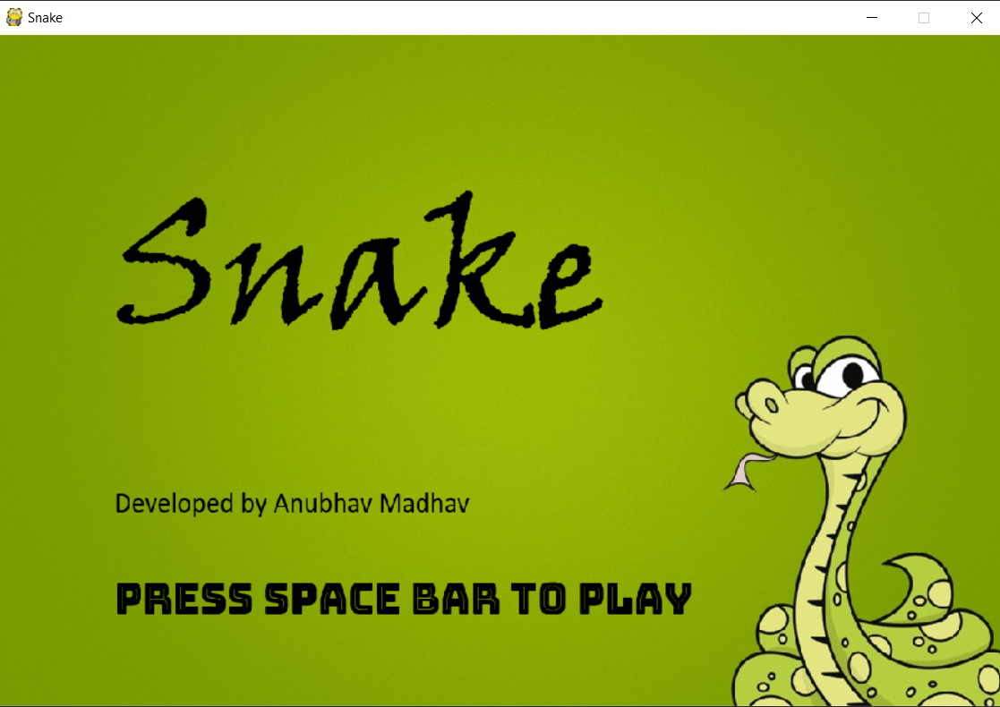
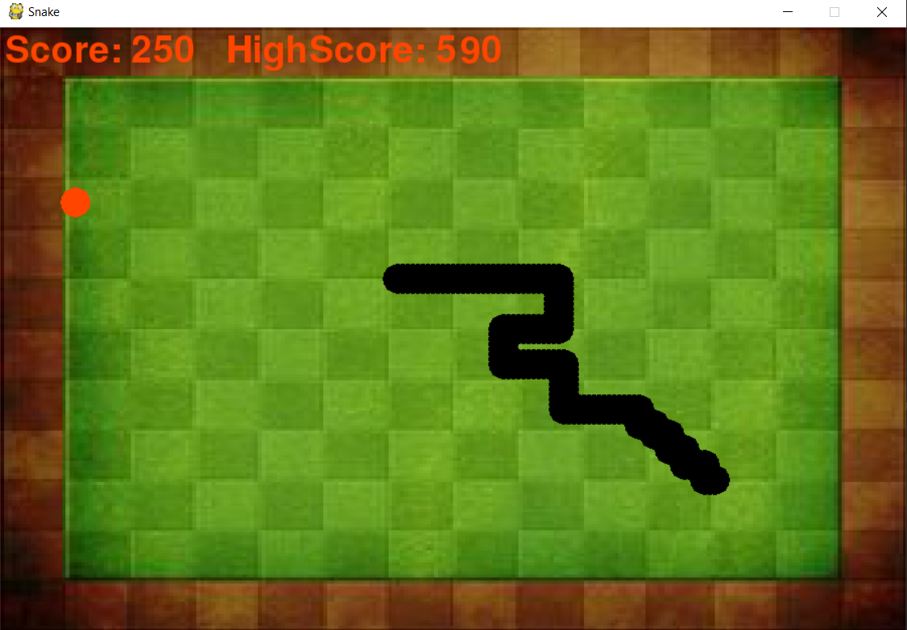
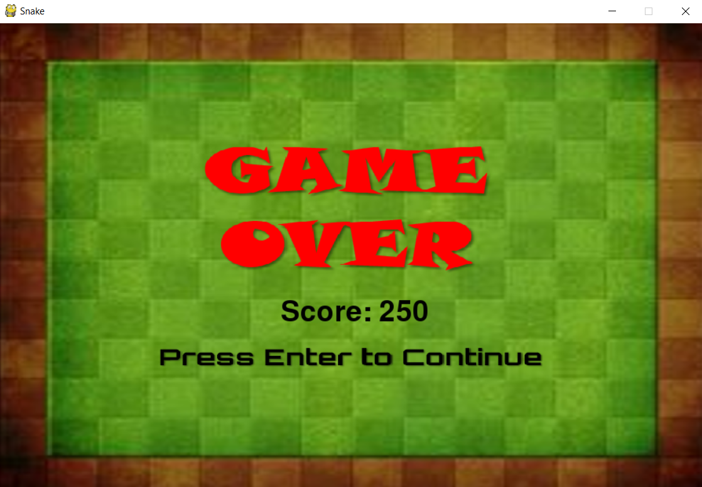

# Snake
[](https://forthebadge.com)

---
This game is developed using Python 3.7.6 & PyGame Module.
---
>Home Page:
---


---
> GamePlay:
---

---
**Steps to Play the Game:**
1) Clone the Repository to your Local Computer <br>
   * Click on the green button "Clone or Download" <br>
   * Click on "Download ZIP"
    
    **OR**
    
    You know how to clone if you're a developer.
        
2) Installing The PyGame Module:
    <br>
    * Open Terminal/CMD
    * Type ```pip install pygame``` or `pip3 install pygame`

    **Note: Install 'pip', if you haven't**
    
3) Double Click on the 'snake.exe' file to play the game.

---
**Rules:**
   * Use Cursor keys to control the snake.
   * Do not crash the snake into walls, else "GameOver!!"
   * Do not crash the snake into itself, else "GameOver!!"
   * Do not press 'left' cursor if snake is already moving towards the right; instead, first move the snake 'up' or 'down', then move left else "GameOver!!" and vice versa.
   * Do not press 'down' cursor if snake is already moving upwards; instead, first move the snake 'left' or 'right', then move down else "GameOver!!" and vice versa.
---

Don't Delete any file.... IT MAY CRASH THE GAME!!
---

---

> **Cheats**
<br>
Press <b>q</b> to add extra 10 points. :smile:

* Follow me on Instagram: [anubhav_madhav](https://www.instagram.com/anubhav_madhav)

### ThankYou!